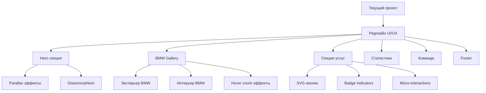

# План редизайна DETAILING SALON LUX

## Обзор проекта

### Цель
Трансформировать текущий проект detailing в премиальный сайт по образцу Webflow шаблона AutoFix, с интеграцией высококачественных BMW изображений и современными UI эффектами.

### Брендинг
- **Название:** DETAILING SALON LUX
- **Владелец:** PAN STEPAN 🤠
- **Разработчик:** Artem Mikhailov

---

## Архитектура изменений



---

## Детальная спецификация изменений

### 1. Обновление брендинга

**Файлы для изменения:**
- [`src/components/Layout.jsx`](src/components/Layout.jsx) - Navbar и Footer
- [`public/locales/en/translation.json`](public/locales/en/translation.json)
- [`public/locales/ru/translation.json`](public/locales/ru/translation.json)
- [`index.html`](index.html) - title и meta

**Изменения:**
- Логотип: **DETAILING SALON LUX**
- Владелец: **PAN STEPAN** 🤠
- Footer: "dev: Artem Mikhailov" сохранить

---

### 2. BMW Gallery Component

**Новый компонент:** [`src/components/BMWGallery.jsx`](src/components/BMWGallery.jsx)

#### Экстерьер изображения:
| Ракурс | Описание | Unsplash ID |
|--------|----------|-------------|
| Front 3/4 | Передний вид под углом | bmw-front-angle |
| Side Profile | Боковой профиль | bmw-side-profile |
| Rear Angle | Задний вид под углом | bmw-rear-angle |

#### Интерьер изображения:
| Элемент | Описание | Unsplash ID |
|---------|----------|-------------|
| Leather Upholstery | Кожаная обивка | bmw-leather-seats |
| Dashboard | Торпеда | bmw-dashboard |
| Steering Wheel | Рулевое колесо | bmw-steering-wheel |
| Door Panels | Дверные панели | bmw-door-panels |

#### Стилизация изображений:
```css
.bmw-image {
  border-radius: 16px;
  box-shadow: 0 25px 50px -12px rgba(0, 0, 0, 0.5);
  transition: transform 0.5s cubic-bezier(0.4, 0, 0.2, 1);
  aspect-ratio: 16/9;
}

.bmw-image:hover {
  transform: scale(1.05);
  box-shadow: 0 35px 60px -15px rgba(0, 145, 255, 0.3);
}
```

---

### 3. Анимированные SVG иконки

**Новый компонент:** [`src/components/AnimatedIcons.jsx`](src/components/AnimatedIcons.jsx) - расширить

#### Иконки для услуг:
| Иконка | Название | Анимация |
|--------|----------|----------|
| 🚗 car | Автомобиль | Float animation |
| 💧 droplet | Капля воды | Pulse animation |
| 🛡️ shield | Защита | Rotate on hover |
| ✨ sparkle | Блеск | Scale animation |
| ⏰ clock | Время | Tick animation |
| ⭐ star | Рейтинг | Glow animation |

#### SVG структура:
```jsx
<AnimatedIcon 
  name="car" 
  size={48} 
  color="primary" 
  animation="float"
  hoverAnimation="scale"
/>
```

---

### 4. Glassmorphism эффекты

**CSS классы:**
```css
.glass-card {
  background: rgba(255, 255, 255, 0.05);
  backdrop-filter: blur(20px);
  -webkit-backdrop-filter: blur(20px);
  border: 1px solid rgba(255, 255, 255, 0.1);
  border-radius: 24px;
  box-shadow: 0 8px 32px rgba(0, 0, 0, 0.3);
}

.glass-overlay {
  background: linear-gradient(
    135deg,
    rgba(255, 255, 255, 0.1) 0%,
    rgba(255, 255, 255, 0.05) 100%
  );
  backdrop-filter: blur(10px);
}
```

---

### 5. Gradient Accents

**Цветовые градиенты:**
```css
.gradient-primary {
  background: linear-gradient(135deg, #0091FF 0%, #00D4FF 100%);
}

.gradient-luxury {
  background: linear-gradient(135deg, #1a1a1a 0%, #0a0a0a 100%);
}

.gradient-accent {
  background: linear-gradient(
    90deg,
    transparent 0%,
    rgba(0, 145, 255, 0.3) 50%,
    transparent 100%
  );
}

.text-gradient {
  background: linear-gradient(135deg, #FFFFFF 0%, #0091FF 100%);
  -webkit-background-clip: text;
  -webkit-text-fill-color: transparent;
}
```

---

### 6. Parallax Scrolling

**Реализация через Framer Motion:**
```jsx
import { useScroll, useTransform } from 'framer-motion';

const ParallaxSection = ({ children, speed = 0.5 }) => {
  const { scrollY } = useScroll();
  const y = useTransform(scrollY, [0, 1000], [0, 1000 * speed]);
  
  return (
    <motion.div style={{ y }}>
      {children}
    </motion.div>
  );
};
```

---

### 7. Responsive Grid Layout

**Breakpoints:**
| Устройство | Ширина | Колонки | Отступы |
|------------|--------|---------|---------|
| Mobile | < 640px | 1 | 16px |
| Tablet | 640-1024px | 2 | 24px |
| Desktop | > 1024px | 3-4 | 32px |

**Tailwind классы:**
```jsx
<div className="grid grid-cols-1 sm:grid-cols-2 lg:grid-cols-3 xl:grid-cols-4 gap-4 sm:gap-6 lg:gap-8">
  {/* Gallery items */}
</div>
```

---

### 8. Floating Badge Indicators

**Компонент Badge:**
```jsx
<Badge 
  variant="premium" 
  position="top-right"
  animated={true}
>
  LUXURY
</Badge>
```

**Стили:**
```css
.badge {
  position: absolute;
  padding: 4px 12px;
  border-radius: 9999px;
  font-size: 10px;
  font-weight: 700;
  text-transform: uppercase;
  letter-spacing: 0.1em;
  animation: float 3s ease-in-out infinite;
}

.badge-premium {
  background: linear-gradient(135deg, #FFD700 0%, #FFA500 100%);
  color: #000;
  box-shadow: 0 4px 15px rgba(255, 215, 0, 0.4);
}
```

---

### 9. Service Category Symbols

**Категории услуг:**
| Категория | Символ | Цвет |
|-----------|--------|------|
| Exterior | 🚗 | #0091FF |
| Interior | 🛋️ | #8B5CF6 |
| Paint Correction | ✨ | #F59E0B |
| Ceramic Coating | 🛡️ | #10B981 |
| PPF | 📦 | #EC4899 |

---

### 10. Micro-interactions

**Hover эффекты:**
```css
.card-hover {
  transition: all 0.3s cubic-bezier(0.4, 0, 0.2, 1);
}

.card-hover:hover {
  transform: translateY(-8px);
  box-shadow: 0 20px 40px rgba(0, 145, 255, 0.2);
}

.button-hover {
  position: relative;
  overflow: hidden;
}

.button-hover::before {
  content: '';
  position: absolute;
  top: 50%;
  left: 50%;
  width: 0;
  height: 0;
  background: rgba(255, 255, 255, 0.2);
  border-radius: 50%;
  transform: translate(-50%, -50%);
  transition: width 0.6s, height 0.6s;
}

.button-hover:hover::before {
  width: 300px;
  height: 300px;
}
```

---

### 11. Тёмная цветовая палитра LUX

**Основные цвета:**
```css
:root {
  /* Background */
  --bg-primary: #0a0a0a;
  --bg-secondary: #111111;
  --bg-tertiary: #1a1a1a;
  
  /* Text */
  --text-primary: #ffffff;
  --text-secondary: rgba(255, 255, 255, 0.7);
  --text-muted: rgba(255, 255, 255, 0.4);
  
  /* Accent */
  --accent-primary: #0091FF;
  --accent-hover: #00B4FF;
  --accent-glow: rgba(0, 145, 255, 0.3);
  
  /* Luxury */
  --luxury-gold: #FFD700;
  --luxury-chrome: #C0C0C0;
}
```

---

### 12. Hero секция

**Структура:**
```jsx
<section className="hero relative min-h-screen">
  {/* Parallax background */}
  <ParallaxBackground speed={0.3}>
    <BMWImage variant="hero" />
  </ParallaxBackground>
  
  {/* Glassmorphism overlay */}
  <GlassOverlay />
  
  {/* Content */}
  <div className="hero-content relative z-10">
    <AnimatedLogo />
    <h1 className="text-gradient">DETAILING SALON LUX</h1>
    <p className="text-secondary">Premium Car Care Excellence</p>
    <CTAButtons />
  </div>
  
  {/* Stats bar */}
  <StatsBar />
</section>
```

---

### 13. Статистика

**Данные:**
| Метрика | Значение | Иконка |
|---------|----------|--------|
| Happy Clients | 500+ | 👥 |
| Years Experience | 10+ | 📅 |
| Satisfaction | 99% | ⭐ |
| Cars Detailed | 2000+ | 🚗 |

**Компонент:**
```jsx
<StatsBar>
  <StatItem value="500+" label="Happy Clients" icon="users" />
  <StatItem value="10+" label="Years Experience" icon="calendar" />
  <StatItem value="99%" label="Satisfaction" icon="star" />
  <StatItem value="2000+" label="Cars Detailed" icon="car" />
</StatsBar>
```

---

### 14. Секция услуг

**Услуги:**
1. **Exterior Detailing** - Полная мойка и полировка кузова
2. **Interior Detailing** - Глубокая чистка салона
3. **Paint Correction** - Удаление царапин и вихрей
4. **Ceramic Coating** - Керамическое покрытие
5. **Paint Protection Film** - Защитная плёнка PPF

**Карточка услуги:**
```jsx
<ServiceCard>
  <AnimatedIcon name="car" />
  <Badge variant="popular">Popular</Badge>
  <h3>Exterior Detailing</h3>
  <p>Description...</p>
  <ServiceFeatures />
  <PriceTag value="$199" />
  <BookButton />
</ServiceCard>
```

---

### 15. Секция команды

**Команда:**
| Имя | Должность | Фото |
|-----|-----------|------|
| PAN STEPAN | Owner & Founder | stepan.jpg |
| Artem Mikhailov | Lead Detailer | artem.jpg |

---

### 16. Footer

**Структура:**
```jsx
<footer className="bg-black border-t border-white/10">
  <div className="footer-content">
    <Logo />
    <SocialLinks />
    <Navigation />
    <ContactInfo />
    <Newsletter />
  </div>
  <div className="footer-bottom">
    <Copyright />
    <DeveloperCredit>dev: Artem Mikhailov</DeveloperCredit>
  </div>
</footer>
```

---

## Файловая структура

```
src/
├── components/
│   ├── Layout.jsx           # Navbar + Footer (update)
│   ├── BMWGallery.jsx       # New component
│   ├── AnimatedIcons.jsx    # Extended
│   ├── GlassCard.jsx        # New component
│   ├── Badge.jsx            # New component
│   ├── StatsBar.jsx         # New component
│   ├── ServiceCard.jsx      # New component
│   └── ParallaxSection.jsx  # New component
├── pages/
│   └── Home.jsx             # Integrate all sections
├── styles/
│   └── luxury-theme.css     # New styles
└── constants/
    └── config.js            # Update branding
```

---

## Порядок реализации

### Фаза 1: Брендинг и базовые компоненты
1. Обновить логотип и название во всех файлах
2. Создать AnimatedIcons с SVG анимациями
3. Создать GlassCard компонент
4. Создать Badge компонент

### Фаза 2: BMW Gallery
5. Создать BMWGallery компонент
6. Интегрировать BMW фото (экстерьер + интерьер)
7. Добавить hover zoom эффекты
8. Реализовать responsive grid

### Фаза 3: Hero и статистика
9. Редизайн Hero секции с parallax
10. Создать StatsBar компонент
11. Добавить glassmorphism overlays

### Фаза 4: Секции страницы
12. Обновить секцию услуг
13. Создать секцию команды
14. Обновить Footer

### Фаза 5: Полировка
15. Добавить micro-interactions
16. Оптимизировать анимации
17. Тестирование responsive

---

## Сохраняемый функционал

- ✅ Booking система
- ✅ Calculator
- ✅ Dashboard
- ✅ Gallery (расширить BMW фото)
- ✅ i18n (переводы)
- ✅ Theme toggle
- ✅ API endpoints
- ✅ Database

---

## Источники BMW изображений

**Рекомендуемые Unsplash коллекции:**
- BMW M Series: https://unsplash.com/s/photos/bmw-m
- BMW Interior: https://unsplash.com/s/photos/bmw-interior
- Luxury Cars: https://unsplash.com/s/photos/luxury-car-detailing

**Высококачественные изображения:**
- Минимальное разрешение: 1920x1080
- Формат: WebP для оптимизации
- Цветовая коррекция: тёмные тона для LUX бренда
