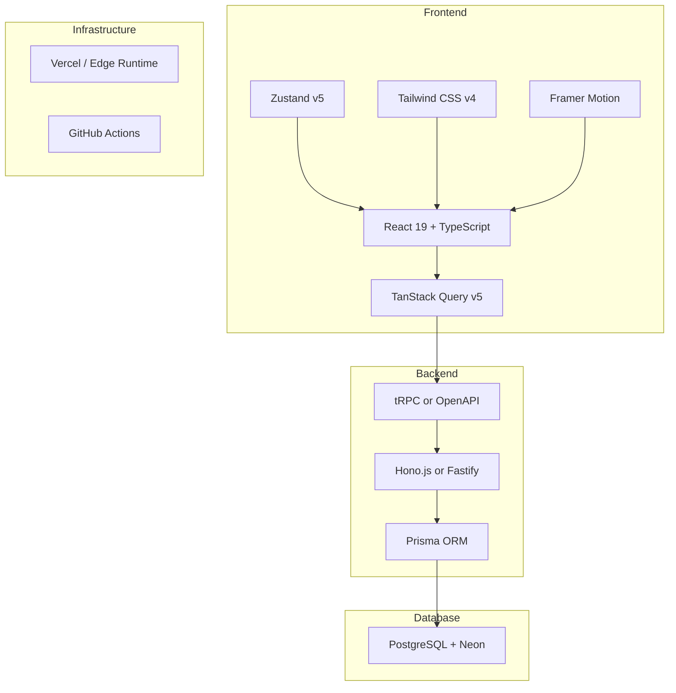

# Full Stack Modernization Plan

## Executive Summary

This document outlines a comprehensive modernization strategy for the LUXE Detailing application, transforming it from a JavaScript-based codebase to a modern, type-safe, and maintainable architecture.

---

## Current State Analysis

### Technology Stack

| Layer | Current Technology | Issues |
|-------|-------------------|--------|
| Frontend | React 19, Vite, Tailwind CSS, Framer Motion | No TypeScript, inconsistent state management |
| Backend | Express.js 5.x | No type safety, mixed concerns in routes |
| Database | PostgreSQL via Neon + pg Pool | Raw SQL queries, dual connection systems |
| Auth | JWT + bcrypt | Custom implementation, no refresh token rotation |
| State | Zustand + Context API | Inconsistent usage patterns |
| Testing | Vitest, Playwright | Good coverage, but no type checking |

### Key Issues Identified

1. **No Type Safety** - JavaScript throughout, runtime errors common
2. **Raw SQL Queries** - SQL injection risks, no compile-time validation
3. **Mixed Concerns** - Routes contain validation, business logic, and DB access
4. **Dual Database Connections** - Both pg Pool and Neon serverless
5. **No Data Fetching Layer** - Manual fetch calls, no caching strategy
6. **Inconsistent State Management** - Mix of Zustand and Context API

---

## Proposed Architecture Overview

### Technology Decisions

- **Frontend**: React 19 + TypeScript + TanStack Query + Zustand
- **Backend**: Hono.js + Prisma ORM
- **Database**: PostgreSQL + Neon (unchanged)
- **Infrastructure**: Vercel Edge Runtime + GitHub Actions

---

## Phase 1: TypeScript Migration

### 1.1 Project Setup

```bash
npm install -D typescript @types/node @types/react @types/react-dom
npm install -D @typescript-eslint/eslint-plugin @typescript-eslint/parser
```

### 1.2 Migration Strategy

**Incremental Migration Approach:**

1. Enable JSDoc type checking first
2. Migrate by layer - constants, configs, utilities, hooks, components, routes
3. File-by-file conversion with strict mode enabled progressively

### 1.3 Type Definitions Structure

```
src/
├── types/
│   ├── api.ts          # API request/response types
│   ├── models.ts       # Database model types
│   ├── components.ts   # Component prop types
│   └── hooks.ts        # Hook type definitions
```

---

## Phase 2: Backend Modernization

### 2.1 Framework Migration: Express to Hono

**Why Hono?**
- Ultra-fast edge runtime support
- First-class TypeScript support
- Built-in middleware ecosystem
- Smaller bundle size
- Works on Vercel Edge, Cloudflare Workers

### 2.2 ORM Migration: Raw SQL to Prisma

**Why Prisma?**
- Type-safe database access
- Auto-generated types
- Migration management
- Visual database browser
- Excellent TypeScript integration

### 2.3 API Layer Architecture

**Three-Layer Architecture:**

1. **Repository Layer** - Database operations
2. **Service Layer** - Business logic
3. **Route Layer** - HTTP handling and validation

---

## Phase 3: Frontend Modernization

### 3.1 Data Fetching: TanStack Query

- Centralized API client with Zod validation
- Custom hooks for all data operations
- Automatic caching and invalidation

### 3.2 State Management: Zustand Consolidation

- Single unified store for UI state
- Remove Context API for state management
- Persist preferences to localStorage

### 3.3 Component Architecture

- Compound components pattern for complex UI
- Consistent prop interfaces
- TypeScript for all components

---

## Phase 4: Infrastructure Improvements

### 4.1 Monorepo Structure

```
detailing/
├── apps/
│   ├── web/           # Vite React app
│   └── api/           # Hono backend
├── packages/
│   ├── shared/        # Shared types and utilities
│   ├── ui/            # Shared UI components
│   └── database/      # Prisma schema and client
├── turbo.json
└── pnpm-workspace.yaml
```

### 4.2 CI/CD Pipeline

- Lint and typecheck on every PR
- Automated tests
- E2E testing with Playwright

---

## Implementation Roadmap

### Sprint 1: Foundation
- Set up TypeScript configuration
- Create type definitions for existing models
- Migrate constants and config files
- Set up ESLint with TypeScript rules

### Sprint 2: Database Layer
- Create Prisma schema
- Run initial migration
- Create repository layer
- Migrate database utilities

### Sprint 3: Backend Migration
- Set up Hono application
- Migrate authentication routes
- Migrate booking routes
- Migrate remaining API routes

### Sprint 4: Frontend Data Layer
- Set up TanStack Query
- Create API client
- Create custom hooks for data fetching
- Migrate components to use hooks

### Sprint 5: Frontend Components
- Migrate components to TypeScript
- Implement compound component patterns
- Consolidate state management
- Update testing infrastructure

### Sprint 6: Polish and Deploy
- Performance optimization
- Security audit
- Documentation
- Deployment pipeline updates

---

## Risk Mitigation

| Risk | Mitigation Strategy |
|------|---------------------|
| Breaking changes | Incremental migration with feature flags |
| Data loss | Prisma migrations with backup strategy |
| Performance regression | Benchmark before and after each phase |
| Team learning curve | Pair programming and documentation |

---

## Success Metrics

- **Type Coverage**: Greater than 90% of codebase typed
- **Build Time**: Less than 30 seconds for full build
- **Bundle Size**: Less than 200KB initial JS bundle
- **Test Coverage**: Greater than 80% code coverage
- **Lighthouse Score**: Greater than 90 for all metrics

## Executive Summary

This document outlines a comprehensive modernization strategy for the LUXE Detailing application, transforming it from a JavaScript-based codebase to a modern, type-safe, and maintainable architecture.

---

## Current State Analysis

### Technology Stack

| Layer | Current Technology | Issues |
|-------|-------------------|--------|
| Frontend | React 19, Vite, Tailwind CSS, Framer Motion | No TypeScript, inconsistent state management |
| Backend | Express.js 5.x | No type safety, mixed concerns in routes |
| Database | PostgreSQL via Neon + pg Pool | Raw SQL queries, dual connection systems |
| Auth | JWT + bcrypt | Custom implementation, no refresh token rotation |
| State | Zustand + Context API | Inconsistent usage patterns |
| Testing | Vitest, Playwright | Good coverage, but no type checking |

### Key Issues Identified

1. **No Type Safety** - JavaScript throughout, runtime errors common
2. **Raw SQL Queries** - SQL injection risks, no compile-time validation
3. **Mixed Concerns** - Routes contain validation, business logic, and DB access
4. **Dual Database Connections** - Both pg Pool and Neon serverless
5. **No Data Fetching Layer** - Manual fetch calls, no caching strategy
6. **Inconsistent State Management** - Mix of Zustand and Context API

---

## Proposed Architecture Overview

### Technology Decisions

- **Frontend**: React 19 + TypeScript + TanStack Query + Zustand
- **Backend**: Hono.js + Prisma ORM
- **Database**: PostgreSQL + Neon (unchanged)
- **Infrastructure**: Vercel Edge Runtime + GitHub Actions

---

## Phase 1: TypeScript Migration

### 1.1 Project Setup

```bash
npm install -D typescript @types/node @types/react @types/react-dom
npm install -D @typescript-eslint/eslint-plugin @typescript-eslint/parser
```

### 1.2 Migration Strategy

**Incremental Migration Approach:**

1. Enable JSDoc type checking first
2. Migrate by layer - constants, configs, utilities, hooks, components, routes
3. File-by-file conversion with strict mode enabled progressively

### 1.3 Type Definitions Structure

```
src/
├── types/
│   ├── api.ts          # API request/response types
│   ├── models.ts       # Database model types
│   ├── components.ts   # Component prop types
│   └── hooks.ts        # Hook type definitions
```

---

## Phase 2: Backend Modernization

### 2.1 Framework Migration: Express to Hono

**Why Hono?**
- Ultra-fast edge runtime support
- First-class TypeScript support
- Built-in middleware ecosystem
- Smaller bundle size
- Works on Vercel Edge, Cloudflare Workers

### 2.2 ORM Migration: Raw SQL to Prisma

**Why Prisma?**
- Type-safe database access
- Auto-generated types
- Migration management
- Visual database browser
- Excellent TypeScript integration

### 2.3 API Layer Architecture

**Three-Layer Architecture:**

1. **Repository Layer** - Database operations
2. **Service Layer** - Business logic
3. **Route Layer** - HTTP handling and validation

---

## Phase 3: Frontend Modernization

### 3.1 Data Fetching: TanStack Query

- Centralized API client with Zod validation
- Custom hooks for all data operations
- Automatic caching and invalidation

### 3.2 State Management: Zustand Consolidation

- Single unified store for UI state
- Remove Context API for state management
- Persist preferences to localStorage

### 3.3 Component Architecture

- Compound components pattern for complex UI
- Consistent prop interfaces
- TypeScript for all components

---

## Phase 4: Infrastructure Improvements

### 4.1 Monorepo Structure

```
detailing/
├── apps/
│   ├── web/           # Vite React app
│   └── api/           # Hono backend
├── packages/
│   ├── shared/        # Shared types and utilities
│   ├── ui/            # Shared UI components
│   └── database/      # Prisma schema and client
├── turbo.json
└── pnpm-workspace.yaml
```

### 4.2 CI/CD Pipeline

- Lint and typecheck on every PR
- Automated tests
- E2E testing with Playwright

---

## Implementation Roadmap

### Sprint 1: Foundation
- Set up TypeScript configuration
- Create type definitions for existing models
- Migrate constants and config files
- Set up ESLint with TypeScript rules

### Sprint 2: Database Layer
- Create Prisma schema
- Run initial migration
- Create repository layer
- Migrate database utilities

### Sprint 3: Backend Migration
- Set up Hono application
- Migrate authentication routes
- Migrate booking routes
- Migrate remaining API routes

### Sprint 4: Frontend Data Layer
- Set up TanStack Query
- Create API client
- Create custom hooks for data fetching
- Migrate components to use hooks

### Sprint 5: Frontend Components
- Migrate components to TypeScript
- Implement compound component patterns
- Consolidate state management
- Update testing infrastructure

### Sprint 6: Polish and Deploy
- Performance optimization
- Security audit
- Documentation
- Deployment pipeline updates

---

## Risk Mitigation

| Risk | Mitigation Strategy |
|------|---------------------|
| Breaking changes | Incremental migration with feature flags |
| Data loss | Prisma migrations with backup strategy |
| Performance regression | Benchmark before and after each phase |
| Team learning curve | Pair programming and documentation |

---

## Success Metrics

- **Type Coverage**: Greater than 90% of codebase typed
- **Build Time**: Less than 30 seconds for full build
- **Bundle Size**: Less than 200KB initial JS bundle
- **Test Coverage**: Greater than 80% code coverage
- **Lighthouse Score**: Greater than 90 for all metrics

## Executive Summary

This document outlines a comprehensive modernization strategy for the LUXE Detailing application, transforming it from a JavaScript-based codebase to a modern, type-safe, and maintainable architecture.

---

## Current State Analysis

### Technology Stack

| Layer | Current Technology | Issues |
|-------|-------------------|--------|
| Frontend | React 19, Vite, Tailwind CSS, Framer Motion | No TypeScript, inconsistent state management |
| Backend | Express.js 5.x | No type safety, mixed concerns in routes |
| Database | PostgreSQL via Neon + pg Pool | Raw SQL queries, dual connection systems |
| Auth | JWT + bcrypt | Custom implementation, no refresh token rotation |
| State | Zustand + Context API | Inconsistent usage patterns |
| Testing | Vitest, Playwright | Good coverage, but no type checking |

### Key Issues Identified

1. **No Type Safety** - JavaScript throughout, runtime errors common
2. **Raw SQL Queries** - SQL injection risks, no compile-time validation
3. **Mixed Concerns** - Routes contain validation, business logic, and DB access
4. **Dual Database Connections** - Both pg Pool and Neon serverless
5. **No Data Fetching Layer** - Manual fetch calls, no caching strategy
6. **Inconsistent State Management** - Mix of Zustand and Context API

---

## Proposed Architecture Overview

### Technology Decisions

- **Frontend**: React 19 + TypeScript + TanStack Query + Zustand
- **Backend**: Hono.js + Prisma ORM
- **Database**: PostgreSQL + Neon - unchanged
- **Infrastructure**: Vercel Edge Runtime + GitHub Actions

---

## Phase 1: TypeScript Migration

### 1.1 Project Setup

```bash
npm install -D typescript @types/node @types/react @types/react-dom
npm install -D @typescript-eslint/eslint-plugin @typescript-eslint/parser
```

### 1.2 Migration Strategy

**Incremental Migration Approach:**

1. Enable JSDoc type checking first
2. Migrate by layer - constants, configs, utilities, hooks, components, routes
3. File-by-file conversion with strict mode enabled progressively

### 1.3 Type Definitions Structure

```
src/
├── types/
│   ├── api.ts          # API request/response types
│   ├── models.ts       # Database model types
│   ├── components.ts   # Component prop types
│   └── hooks.ts        # Hook type definitions
```

---

## Phase 2: Backend Modernization

### 2.1 Framework Migration: Express to Hono

**Why Hono?**
- Ultra-fast edge runtime support
- First-class TypeScript support
- Built-in middleware ecosystem
- Smaller bundle size
- Works on Vercel Edge, Cloudflare Workers

### 2.2 ORM Migration: Raw SQL to Prisma

**Why Prisma?**
- Type-safe database access
- Auto-generated types
- Migration management
- Visual database browser
- Excellent TypeScript integration

### 2.3 API Layer Architecture

**Three-Layer Architecture:**

1. **Repository Layer** - Database operations
2. **Service Layer** - Business logic
3. **Route Layer** - HTTP handling and validation

---

## Phase 3: Frontend Modernization

### 3.1 Data Fetching: TanStack Query

- Centralized API client with Zod validation
- Custom hooks for all data operations
- Automatic caching and invalidation

### 3.2 State Management: Zustand Consolidation

- Single unified store for UI state
- Remove Context API for state management
- Persist preferences to localStorage

### 3.3 Component Architecture

- Compound components pattern for complex UI
- Consistent prop interfaces
- TypeScript for all components

---

## Phase 4: Infrastructure Improvements

### 4.1 Monorepo Structure

```
detailing/
├── apps/
│   ├── web/           # Vite React app
│   └── api/           # Hono backend
├── packages/
│   ├── shared/        # Shared types and utilities
│   ├── ui/            # Shared UI components
│   └── database/      # Prisma schema and client
├── turbo.json
└── pnpm-workspace.yaml
```

### 4.2 CI/CD Pipeline

- Lint and typecheck on every PR
- Automated tests
- E2E testing with Playwright

---

## Implementation Roadmap

### Sprint 1: Foundation
- Set up TypeScript configuration
- Create type definitions for existing models
- Migrate constants and config files
- Set up ESLint with TypeScript rules

### Sprint 2: Database Layer
- Create Prisma schema
- Run initial migration
- Create repository layer
- Migrate database utilities

### Sprint 3: Backend Migration
- Set up Hono application
- Migrate authentication routes
- Migrate booking routes
- Migrate remaining API routes

### Sprint 4: Frontend Data Layer
- Set up TanStack Query
- Create API client
- Create custom hooks for data fetching
- Migrate components to use hooks

### Sprint 5: Frontend Components
- Migrate components to TypeScript
- Implement compound component patterns
- Consolidate state management
- Update testing infrastructure

### Sprint 6: Polish and Deploy
- Performance optimization
- Security audit
- Documentation
- Deployment pipeline updates

---

## Risk Mitigation

| Risk | Mitigation Strategy |
|------|---------------------|
| Breaking changes | Incremental migration with feature flags |
| Data loss | Prisma migrations with backup strategy |
| Performance regression | Benchmark before and after each phase |
| Team learning curve | Pair programming and documentation |

---

## Success Metrics

- **Type Coverage**: Greater than 90% of codebase typed
- **Build Time**: Less than 30 seconds for full build
- **Bundle Size**: Less than 200KB initial JS bundle
- **Test Coverage**: Greater than 80% code coverage
- **Lighthouse Score**: Greater than 90 for all metrics

  createdAt       DateTime @default(now()) @map("created_at")
  updatedAt       DateTime @updatedAt @map("updated_at")
  
  user    User     @relation(fields: [userId], references: [id])
  vehicle Vehicle? @relation(fields: [vehicleId], references: [id])
  
  @@map("bookings")
}

enum Role {
  CUSTOMER
  STAFF
  ADMIN
}

enum BookingStatus {
  PENDING
  CONFIRMED
  IN_PROGRESS
  COMPLETED
  CANCELLED
}
```

### 2.3 API Layer Architecture

**Repository Pattern:**

```typescript
// repositories/booking.repository.ts
import { PrismaClient, Booking, BookingStatus } from '@prisma/client';

export class BookingRepository {
  constructor(private prisma: PrismaClient) {}

  async findById(id: string): Promise<Booking | null> {
    return this.prisma.booking.findUnique({
      where: { id },
      include: { user: true, vehicle: true }
    });
  }

  async findByUserId(userId: string, options: PaginationOptions) {
    return this.prisma.booking.findMany({
      where: { userId },
      skip: options.offset,
      take: options.limit,
      orderBy: { createdAt: 'desc' }
    });
  }
}
```

**Service Layer:**

```typescript
// services/booking.service.ts
export class BookingService {
  constructor(
    private bookingRepo: BookingRepository,
    private notificationService: NotificationService
  ) {}

  async createBooking(data: CreateBookingDto): Promise<Booking> {
    // Business logic validation
    await this.validateBookingTime(data.date, data.time);
    
    const booking = await this.bookingRepo.create(data);
    
    // Side effects
    await this.notificationService.sendConfirmation(booking);
    
    return booking;
  }
}
```

**Route Handlers:**

```typescript
// routes/booking.routes.ts
import { Hono } from 'hono';
import { zValidator } from '@hono/zod-validator';
import { bookingSchema } from '../schemas/booking.schema';

const bookings = new Hono();

bookings.get('/', authMiddleware, async (c) => {
  const service = c.get('bookingService');
  const userId = c.get('userId');
  const bookings = await service.getUserBookings(userId);
  return c.json({ data: bookings });
});

bookings.post('/', 
  authMiddleware,
  zValidator('json', bookingSchema),
  async (c) => {
    const data = c.req.valid('json');
    const booking = await c.get('bookingService').createBooking(data);
    return c.json(booking, 201);
  }
);
```

---

## Phase 3: Frontend Modernization

### 3.1 Data Fetching: TanStack Query

**Setup:**

```typescript
// lib/query-client.ts
import { QueryClient } from '@tanstack/react-query';

export const queryClient = new QueryClient({
  defaultOptions: {
    queries: {
      staleTime: 5 * 60 * 1000,
      gcTime: 10 * 60 * 1000,
      retry: 2
    }
  }
});
```

**API Client:**

```typescript
// lib/api-client.ts
import { z } from 'zod';

class ApiClient {
  private baseUrl = '/api/v1';

  async get<T>(path: string, schema: z.ZodType<T>): Promise<T> {
    const response = await fetch(`${this.baseUrl}${path}`);
    const data = await response.json();
    return schema.parse(data);
  }

  async post<T>(path: string, body: unknown, schema: z.ZodType<T>): Promise<T> {
    const response = await fetch(`${this.baseUrl}${path}`, {
      method: 'POST',
      headers: { 'Content-Type': 'application/json' },
      body: JSON.stringify(body)
    });
    const data = await response.json();
    return schema.parse(data);
  }
}

export const api = new ApiClient();
```

**Custom Hooks:**

```typescript
// hooks/use-bookings.ts
import { useQuery, useMutation, useQueryClient } from '@tanstack/react-query';
import { api } from '../lib/api-client';
import { bookingSchema, type Booking } from '../schemas/booking';

export function useBookings() {
  return useQuery({
    queryKey: ['bookings'],
    queryFn: () => api.get<{ data: Booking[] }>('/bookings', bookingArraySchema)
  });
}

export function useCreateBooking() {
  const queryClient = useQueryClient();
  
  return useMutation({
    mutationFn: (data: CreateBookingInput) => 
      api.post('/bookings', data, bookingSchema),
    onSuccess: () => {
      queryClient.invalidateQueries({ queryKey: ['bookings'] });
    }
  });
}
```

### 3.2 State Management: Zustand Consolidation

**Unified Store Pattern:**

```typescript
// stores/app.store.ts
import { create } from 'zustand';
import { devtools, persist } from 'zustand/middleware';

interface AppState {
  // Theme
  theme: 'light' | 'dark';
  setTheme: (theme: 'light' | 'dark') => void;
  
  // UI State
  sidebarOpen: boolean;
  toggleSidebar: () => void;
  
  // User preferences
  preferences: UserPreferences;
  updatePreferences: (prefs: Partial<UserPreferences>) => void;
}

export const useAppStore = create<AppState>()(
  devtools(
    persist(
      (set) => ({
        theme: 'dark',
        setTheme: (theme) => set({ theme }),
        sidebarOpen: false,
        toggleSidebar: () => set((s) => ({ sidebarOpen: !s.sidebarOpen })),
        preferences: defaultPreferences,
        updatePreferences: (prefs) => 
          set((s) => ({ preferences: { ...s.preferences, ...prefs } }))
      }),
      { name: 'app-store' }
    )
  )
);
```

### 3.3 Component Architecture

**Compound Components Pattern:**

```typescript
// components/ui/booking-card.tsx
import { createContext, useContext } from 'react';

interface BookingCardContextValue {
  booking: Booking;
  isExpanded: boolean;
  toggleExpand: () => void;
}

const BookingCardContext = createContext<BookingCardContextValue | null>(null);

function useBookingCard() {
  const context = useContext(BookingCardContext);
  if (!context) throw new Error('Must be used within BookingCard');
  return context;
}

// Compound component parts
export const BookingCard = {
  Root: ({ booking, children }: { booking: Booking; children: React.ReactNode }) => (
    <BookingCardContext.Provider value={{ booking, isExpanded, toggleExpand }}>
      <article className="booking-card">{children}</article>
    </BookingCardContext.Provider>
  ),
  Header: () => {
    const { booking } = useBookingCard();
    return <header>...</header>;
  },
  Body: () => {
    const { booking } = useBookingCard();
    return <div>...</div>;
  },
  Actions: () => {
    const { booking } = useBookingCard();
    return <div className="actions">...</div>;
  }
};
```

---

## Phase 4: Infrastructure Improvements

### 4.1 Monorepo Structure

```
detailing/
├── apps/
│   ├── web/                 # Next.js or Vite React app
│   └── api/                 # Hono backend
├── packages/
│   ├── shared/              # Shared types and utilities
│   ├── ui/                  # Shared UI components
│   └── database/            # Prisma schema and client
├── tools/
│   └── scripts/
├── turbo.json
├── package.json
└── pnpm-workspace.yaml
```

### 4.2 CI/CD Pipeline

```yaml
# .github/workflows/ci.yml
name: CI

on:
  push:
    branches: [main, develop]
  pull_request:
    branches: [main]

jobs:
  lint-and-typecheck:
    runs-on: ubuntu-latest
    steps:
      - uses: actions/checkout@v4
      - uses: pnpm/action-setup@v2
      - run: pnpm install
      - run: pnpm turbo lint typecheck

  test:
    runs-on: ubuntu-latest
    steps:
      - uses: actions/checkout@v4
      - uses: pnpm/action-setup@v2
      - run: pnpm install
      - run: pnpm turbo test

  e2e:
    runs-on: ubuntu-latest
    steps:
      - uses: actions/checkout@v4
      - uses: pnpm/action-setup@v2
      - run: pnpm install
      - run: pnpm turbo build
      - run: pnpm turbo e2e
```

---

## Implementation Roadmap

### Sprint 1: Foundation
- [ ] Set up TypeScript configuration
- [ ] Create type definitions for existing models
- [ ] Migrate constants and config files
- [ ] Set up ESLint with TypeScript rules

### Sprint 2: Database Layer
- [ ] Create Prisma schema
- [ ] Run initial migration
- [ ] Create repository layer
- [ ] Migrate database utilities

### Sprint 3: Backend Migration
- [ ] Set up Hono application
- [ ] Migrate authentication routes
- [ ] Migrate booking routes
- [ ] Migrate remaining API routes

### Sprint 4: Frontend Data Layer
- [ ] Set up TanStack Query
- [ ] Create API client
- [ ] Create custom hooks for data fetching
- [ ] Migrate components to use hooks

### Sprint 5: Frontend Components
- [ ] Migrate components to TypeScript
- [ ] Implement compound component patterns
- [ ] Consolidate state management
- [ ] Update testing infrastructure

### Sprint 6: Polish and Deploy
- [ ] Performance optimization
- [ ] Security audit
- [ ] Documentation
- [ ] Deployment pipeline updates

---

## Risk Mitigation

| Risk | Mitigation Strategy |
|------|---------------------|
| Breaking changes | Incremental migration with feature flags |
| Data loss | Prisma migrations with backup strategy |
| Performance regression | Benchmark before/after each phase |
| Team learning curve | Pair programming and documentation |

---

## Success Metrics

- **Type Coverage**: Greater than 90% of codebase typed
- **Build Time**: Less than 30 seconds for full build
- **Bundle Size**: Less than 200KB initial JS bundle
- **Test Coverage**: Greater than 80% code coverage
- **Lighthouse Score**: Greater than 90 for all metrics

## Executive Summary

This document outlines a comprehensive modernization strategy for the LUXE Detailing application, transforming it from a JavaScript-based codebase to a modern, type-safe, and maintainable architecture.

---

## Current State Analysis

### Technology Stack

| Layer | Current Technology | Issues |
|-------|-------------------|--------|
| Frontend | React 19, Vite, Tailwind CSS, Framer Motion | No TypeScript, inconsistent state management |
| Backend | Express.js 5.x | No type safety, mixed concerns in routes |
| Database | PostgreSQL via Neon + pg Pool | Raw SQL queries, dual connection systems |
| Auth | JWT + bcrypt | Custom implementation, no refresh token rotation |
| State | Zustand + Context API | Inconsistent usage patterns |
| Testing | Vitest, Playwright | Good coverage, but no type checking |

### Key Issues Identified

1. **No Type Safety** - JavaScript throughout, runtime errors common
2. **Raw SQL Queries** - SQL injection risks, no compile-time validation
3. **Mixed Concerns** - Routes contain validation, business logic, and DB access
4. **Dual Database Connections** - Both `pg` Pool and `@neondatabase/serverless`
5. **No Data Fetching Layer** - Manual fetch calls, no caching strategy
6. **Inconsistent State Management** - Mix of Zustand and Context API

---

## Proposed Architecture

### Technology Decisions



---

## Phase 1: TypeScript Migration

### 1.1 Project Setup

```bash
# New TypeScript configuration
npm install -D typescript @types/node @types/react @types/react-dom
npm install -D @typescript-eslint/eslint-plugin @typescript-eslint/parser
```

### 1.2 Migration Strategy

**Incremental Migration Approach:**

1. **Enable JSDoc type checking first**
   ```json
   // tsconfig.json
   {
     "compilerOptions": {
       "allowJs": true,
       "checkJs": true,
       "noEmit": true,
       "strict": false
     }
   }
   ```

2. **Migrate by layer:**
   - Constants and configs - easiest
   - Database schemas and types
   - Utility functions
   - React hooks
   - Components
   - API routes

3. **File-by-file conversion:**
   - Rename `.js` to `.ts`
   - Add type annotations
   - Fix type errors
   - Enable stricter options

### 1.3 Type Definitions Structure

```
src/
├── types/
│   ├── api.ts          # API request/response types
│   ├── models.ts       # Database model types
│   ├── components.ts   # Component prop types
│   └── hooks.ts        # Hook type definitions
├── generated/
│   └── prisma/         # Auto-generated Prisma types
```

---

## Phase 2: Backend Modernization

### 2.1 Framework Migration: Express to Hono

**Why Hono?**
- Ultra-fast edge runtime support
- First-class TypeScript support
- Built-in middleware ecosystem
- Smaller bundle size
- Works on Vercel Edge, Cloudflare Workers

**Migration Example:**

```typescript
// Before: Express
import express from 'express';
const app = express();
app.get('/api/bookings', authenticateToken, handler);

// After: Hono
import { Hono } from 'hono';
import { cors } from 'hono/cors';
import { logger } from 'hono/logger';

const app = new Hono();
app.get('/api/bookings', authMiddleware, handler);
```

### 2.2 ORM Migration: Raw SQL to Prisma

**Why Prisma?**
- Type-safe database access
- Auto-generated types
- Migration management
- Visual database browser
- Excellent TypeScript integration

**Schema Definition:**

```prisma
// prisma/schema.prisma
generator client {
  provider = "prisma-client-js"
}

datasource db {
  provider = "postgresql"
  url      = env("DATABASE_URL")
}

model User {
  id           String     @id @default(uuid())
  email        String     @unique
  passwordHash String     @map("password_hash")
  firstName    String     @map("first_name")
  lastName     String     @map("last_name")
  phone        String?
  role         Role       @default(CUSTOMER)
  isActive     Boolean    @default(true) @map("is_active")
  createdAt    DateTime   @default(now()) @map("created_at")
  updatedAt    DateTime   @updatedAt @map("updated_at")
  
  bookings     Booking[]
  vehicles     Vehicle[]
  
  @@map("users")
}

model Booking {
  id              String   @id @default(uuid())
  userId          String   @map("user_id")
  vehicleId       String?  @map("vehicle_id")
  date            DateTime
  time            String
  carModel        String   @map("car_model")
  packageId       String?  @map("package_id")
  selectedModules Json[]   @map("selected_modules")
  totalPrice      Decimal  @map("total_price")
  status          BookingStatus @default(PENDING)
  notes           String?
  createdAt       DateTime @default(now()) @map("created_at")
  updatedAt       DateTime @updatedAt @map("updated_at")
  
  user    User     @relation(fields: [userId], references: [id])
  vehicle Vehicle? @relation(fields: [vehicleId], references: [id])
  
  @@map("bookings")
}

enum Role {
  CUSTOMER
  STAFF
  ADMIN
}

enum BookingStatus {
  PENDING
  CONFIRMED
  IN_PROGRESS
  COMPLETED
  CANCELLED
}
```

### 2.3 API Layer Architecture

**Repository Pattern:**

```typescript
// repositories/booking.repository.ts
import { PrismaClient, Booking, BookingStatus } from '@prisma/client';

export class BookingRepository {
  constructor(private prisma: PrismaClient) {}

  async findById(id: string): Promise<Booking | null> {
    return this.prisma.booking.findUnique({
      where: { id },
      include: { user: true, vehicle: true }
    });
  }

  async findByUserId(userId: string, options: PaginationOptions) {
    return this.prisma.booking.findMany({
      where: { userId },
      skip: options.offset,
      take: options.limit,
      orderBy: { createdAt: 'desc' }
    });
  }
}
```

**Service Layer:**

```typescript
// services/booking.service.ts
export class BookingService {
  constructor(
    private bookingRepo: BookingRepository,
    private notificationService: NotificationService
  ) {}

  async createBooking(data: CreateBookingDto): Promise<Booking> {
    // Business logic validation
    await this.validateBookingTime(data.date, data.time);
    
    const booking = await this.bookingRepo.create(data);
    
    // Side effects
    await this.notificationService.sendConfirmation(booking);
    
    return booking;
  }
}
```

**Route Handlers:**

```typescript
// routes/booking.routes.ts
import { Hono } from 'hono';
import { zValidator } from '@hono/zod-validator';
import { bookingSchema } from '../schemas/booking.schema';

const bookings = new Hono();

bookings.get('/', authMiddleware, async (c) => {
  const service = c.get('bookingService');
  const userId = c.get('userId');
  const bookings = await service.getUserBookings(userId);
  return c.json({ data: bookings });
});

bookings.post('/', 
  authMiddleware,
  zValidator('json', bookingSchema),
  async (c) => {
    const data = c.req.valid('json');
    const booking = await c.get('bookingService').createBooking(data);
    return c.json(booking, 201);
  }
);
```

---

## Phase 3: Frontend Modernization

### 3.1 Data Fetching: TanStack Query

**Setup:**

```typescript
// lib/query-client.ts
import { QueryClient } from '@tanstack/react-query';

export const queryClient = new QueryClient({
  defaultOptions: {
    queries: {
      staleTime: 5 * 60 * 1000,
      gcTime: 10 * 60 * 1000,
      retry: 2
    }
  }
});
```

**API Client:**

```typescript
// lib/api-client.ts
import { z } from 'zod';

class ApiClient {
  private baseUrl = '/api/v1';

  async get<T>(path: string, schema: z.ZodType<T>): Promise<T> {
    const response = await fetch(`${this.baseUrl}${path}`);
    const data = await response.json();
    return schema.parse(data);
  }

  async post<T>(path: string, body: unknown, schema: z.ZodType<T>): Promise<T> {
    const response = await fetch(`${this.baseUrl}${path}`, {
      method: 'POST',
      headers: { 'Content-Type': 'application/json' },
      body: JSON.stringify(body)
    });
    const data = await response.json();
    return schema.parse(data);
  }
}

export const api = new ApiClient();
```

**Custom Hooks:**

```typescript
// hooks/use-bookings.ts
import { useQuery, useMutation, useQueryClient } from '@tanstack/react-query';
import { api } from '../lib/api-client';
import { bookingSchema, type Booking } from '../schemas/booking';

export function useBookings() {
  return useQuery({
    queryKey: ['bookings'],
    queryFn: () => api.get<{ data: Booking[] }>('/bookings', bookingArraySchema)
  });
}

export function useCreateBooking() {
  const queryClient = useQueryClient();
  
  return useMutation({
    mutationFn: (data: CreateBookingInput) => 
      api.post('/bookings', data, bookingSchema),
    onSuccess: () => {
      queryClient.invalidateQueries({ queryKey: ['bookings'] });
    }
  });
}
```

### 3.2 State Management: Zustand Consolidation

**Unified Store Pattern:**

```typescript
// stores/app.store.ts
import { create } from 'zustand';
import { devtools, persist } from 'zustand/middleware';

interface AppState {
  // Theme
  theme: 'light' | 'dark';
  setTheme: (theme: 'light' | 'dark') => void;
  
  // UI State
  sidebarOpen: boolean;
  toggleSidebar: () => void;
  
  // User preferences
  preferences: UserPreferences;
  updatePreferences: (prefs: Partial<UserPreferences>) => void;
}

export const useAppStore = create<AppState>()(
  devtools(
    persist(
      (set) => ({
        theme: 'dark',
        setTheme: (theme) => set({ theme }),
        sidebarOpen: false,
        toggleSidebar: () => set((s) => ({ sidebarOpen: !s.sidebarOpen })),
        preferences: defaultPreferences,
        updatePreferences: (prefs) => 
          set((s) => ({ preferences: { ...s.preferences, ...prefs } }))
      }),
      { name: 'app-store' }
    )
  )
);
```

### 3.3 Component Architecture

**Compound Components Pattern:**

```typescript
// components/ui/booking-card.tsx
import { createContext, useContext } from 'react';

interface BookingCardContextValue {
  booking: Booking;
  isExpanded: boolean;
  toggleExpand: () => void;
}

const BookingCardContext = createContext<BookingCardContextValue | null>(null);

function useBookingCard() {
  const context = useContext(BookingCardContext);
  if (!context) throw new Error('Must be used within BookingCard');
  return context;
}

// Compound component parts
export const BookingCard = {
  Root: ({ booking, children }: { booking: Booking; children: React.ReactNode }) => (
    <BookingCardContext.Provider value={{ booking, isExpanded, toggleExpand }}>
      <article className="booking-card">{children}</article>
    </BookingCardContext.Provider>
  ),
  Header: () => {
    const { booking } = useBookingCard();
    return <header>...</header>;
  },
  Body: () => {
    const { booking } = useBookingCard();
    return <div>...</div>;
  },
  Actions: () => {
    const { booking } = useBookingCard();
    return <div className="actions">...</div>;
  }
};
```

---

## Phase 4: Infrastructure Improvements

### 4.1 Monorepo Structure

```
detailing/
├── apps/
│   ├── web/                 # Next.js or Vite React app
│   └── api/                 # Hono backend
├── packages/
│   ├── shared/              # Shared types and utilities
│   ├── ui/                  # Shared UI components
│   └── database/            # Prisma schema and client
├── tools/
│   └── scripts/
├── turbo.json
├── package.json
└── pnpm-workspace.yaml
```

### 4.2 CI/CD Pipeline

```yaml
# .github/workflows/ci.yml
name: CI

on:
  push:
    branches: [main, develop]
  pull_request:
    branches: [main]

jobs:
  lint-and-typecheck:
    runs-on: ubuntu-latest
    steps:
      - uses: actions/checkout@v4
      - uses: pnpm/action-setup@v2
      - run: pnpm install
      - run: pnpm turbo lint typecheck

  test:
    runs-on: ubuntu-latest
    steps:
      - uses: actions/checkout@v4
      - uses: pnpm/action-setup@v2
      - run: pnpm install
      - run: pnpm turbo test

  e2e:
    runs-on: ubuntu-latest
    steps:
      - uses: actions/checkout@v4
      - uses: pnpm/action-setup@v2
      - run: pnpm install
      - run: pnpm turbo build
      - run: pnpm turbo e2e
```

---

## Implementation Roadmap

### Sprint 1: Foundation
- [ ] Set up TypeScript configuration
- [ ] Create type definitions for existing models
- [ ] Migrate constants and config files
- [ ] Set up ESLint with TypeScript rules

### Sprint 2: Database Layer
- [ ] Create Prisma schema
- [ ] Run initial migration
- [ ] Create repository layer
- [ ] Migrate database utilities

### Sprint 3: Backend Migration
- [ ] Set up Hono application
- [ ] Migrate authentication routes
- [ ] Migrate booking routes
- [ ] Migrate remaining API routes

### Sprint 4: Frontend Data Layer
- [ ] Set up TanStack Query
- [ ] Create API client
- [ ] Create custom hooks for data fetching
- [ ] Migrate components to use hooks

### Sprint 5: Frontend Components
- [ ] Migrate components to TypeScript
- [ ] Implement compound component patterns
- [ ] Consolidate state management
- [ ] Update testing infrastructure

### Sprint 6: Polish and Deploy
- [ ] Performance optimization
- [ ] Security audit
- [ ] Documentation
- [ ] Deployment pipeline updates

---

## Risk Mitigation

| Risk | Mitigation Strategy |
|------|---------------------|
| Breaking changes | Incremental migration with feature flags |
| Data loss | Prisma migrations with backup strategy |
| Performance regression | Benchmark before/after each phase |
| Team learning curve | Pair programming and documentation |

---

## Success Metrics

- **Type Coverage**: Greater than 90% of codebase typed
- **Build Time**: Less than 30 seconds for full build
- **Bundle Size**: Less than 200KB initial JS bundle
- **Test Coverage**: Greater than 80% code coverage
- **Lighthouse Score**: Greater than 90 for all metrics

## Executive Summary

This document outlines a comprehensive modernization strategy for the LUXE Detailing application, transforming it from a JavaScript-based codebase to a modern, type-safe, and maintainable architecture.

---

## Current State Analysis

### Technology Stack

| Layer | Current Technology | Issues |
|-------|-------------------|--------|
| Frontend | React 19, Vite, Tailwind CSS, Framer Motion | No TypeScript, inconsistent state management |
| Backend | Express.js 5.x | No type safety, mixed concerns in routes |
| Database | PostgreSQL via Neon + pg Pool | Raw SQL queries, dual connection systems |
| Auth | JWT + bcrypt | Custom implementation, no refresh token rotation |
| State | Zustand + Context API | Inconsistent usage patterns |
| Testing | Vitest, Playwright | Good coverage, but no type checking |

### Key Issues Identified

1. **No Type Safety** - JavaScript throughout, runtime errors common
2. **Raw SQL Queries** - SQL injection risks, no compile-time validation
3. **Mixed Concerns** - Routes contain validation, business logic, and DB access
4. **Dual Database Connections** - Both `pg` Pool and `@neondatabase/serverless`
5. **No Data Fetching Layer** - Manual fetch calls, no caching strategy
6. **Inconsistent State Management** - Mix of Zustand and Context API

---

## Proposed Architecture

### Technology Decisions


---

## Phase 1: TypeScript Migration

### 1.1 Project Setup

```bash
# New TypeScript configuration
npm install -D typescript @types/node @types/react @types/react-dom
npm install -D @typescript-eslint/eslint-plugin @typescript-eslint/parser
```

### 1.2 Migration Strategy

**Incremental Migration Approach:**

1. **Enable JSDoc type checking first**
   ```json
   // tsconfig.json
   {
     "compilerOptions": {
       "allowJs": true,
       "checkJs": true,
       "noEmit": true,
       "strict": false
     }
   }
   ```

2. **Migrate by layer:**
   - Constants and configs (easiest)
   - Database schemas and types
   - Utility functions
   - React hooks
   - Components
   - API routes

3. **File-by-file conversion:**
   - Rename `.js` to `.ts`
   - Add type annotations
   - Fix type errors
   - Enable stricter options

### 1.3 Type Definitions Structure

```
src/
├── types/
│   ├── api.ts          # API request/response types
│   ├── models.ts       # Database model types
│   ├── components.ts   # Component prop types
│   └── hooks.ts        # Hook type definitions
├── generated/
│   └── prisma/         # Auto-generated Prisma types
```

---

## Phase 2: Backend Modernization

### 2.1 Framework Migration: Express → Hono

**Why Hono?**
- Ultra-fast edge runtime support
- First-class TypeScript support
- Built-in middleware ecosystem
- Smaller bundle size
- Works on Vercel Edge, Cloudflare Workers

**Migration Example:**

```typescript
// Before: Express
import express from 'express';
const app = express();
app.get('/api/bookings', authenticateToken, handler);

// After: Hono
import { Hono } from 'hono';
import { cors } from 'hono/cors';
import { logger } from 'hono/logger';

const app = new Hono();
app.get('/api/bookings', authMiddleware, handler);
```

### 2.2 ORM Migration: Raw SQL → Prisma

**Why Prisma?**
- Type-safe database access
- Auto-generated types
- Migration management
- Visual database browser
- Excellent TypeScript integration

**Schema Definition:**

```prisma
// prisma/schema.prisma
generator client {
  provider = "prisma-client-js"
}

datasource db {
  provider = "postgresql"
  url      = env("DATABASE_URL")
}

model User {
  id           String     @id @default(uuid())
  email        String     @unique
  passwordHash String     @map("password_hash")
  firstName    String     @map("first_name")
  lastName     String     @map("last_name")
  phone        String?
  role         Role       @default(CUSTOMER)
  isActive     Boolean    @default(true) @map("is_active")
  createdAt    DateTime   @default(now()) @map("created_at")
  updatedAt    DateTime   @updatedAt @map("updated_at")
  
  bookings     Booking[]
  vehicles     Vehicle[]
  
  @@map("users")
}

model Booking {
  id              String   @id @default(uuid())
  userId          String   @map("user_id")
  vehicleId       String?  @map("vehicle_id")
  date            DateTime
  time            String
  carModel        String   @map("car_model")
  packageId       String?  @map("package_id")
  selectedModules Json[]   @map("selected_modules")
  totalPrice      Decimal  @map("total_price")
  status          BookingStatus @default(PENDING)
  notes           String?
  createdAt       DateTime @default(now()) @map("created_at")
  updatedAt       DateTime @updatedAt @map("updated_at")
  
  user    User     @relation(fields: [userId], references: [id])
  vehicle Vehicle? @relation(fields: [vehicleId], references: [id])
  
  @@map("bookings")
}

enum Role {
  CUSTOMER
  STAFF
  ADMIN
}

enum BookingStatus {
  PENDING
  CONFIRMED
  IN_PROGRESS
  COMPLETED
  CANCELLED
}
```

### 2.3 API Layer Architecture

**Repository Pattern:**

```typescript
// repositories/booking.repository.ts
import { PrismaClient, Booking, BookingStatus } from '@prisma/client';

export class BookingRepository {
  constructor(private prisma: PrismaClient) {}

  async findById(id: string): Promise<Booking | null> {
    return this.prisma.booking.findUnique({
      where: { id },
      include: { user: true, vehicle: true }
    });
  }

  async findByUserId(userId: string, options: PaginationOptions) {
    return this.prisma.booking.findMany({
      where: { userId },
      skip: options.offset,
      take: options.limit,
      orderBy: { createdAt: 'desc' }
    });
  }
}
```

**Service Layer:**

```typescript
// services/booking.service.ts
export class BookingService {
  constructor(
    private bookingRepo: BookingRepository,
    private notificationService: NotificationService
  ) {}

  async createBooking(data: CreateBookingDto): Promise<Booking> {
    // Business logic validation
    await this.validateBookingTime(data.date, data.time);
    
    const booking = await this.bookingRepo.create(data);
    
    // Side effects
    await this.notificationService.sendConfirmation(booking);
    
    return booking;
  }
}
```

**Route Handlers:**

```typescript
// routes/booking.routes.ts
import { Hono } from 'hono';
import { zValidator } from '@hono/zod-validator';
import { bookingSchema } from '../schemas/booking.schema';

const bookings = new Hono();

bookings.get('/', authMiddleware, async (c) => {
  const service = c.get('bookingService');
  const userId = c.get('userId');
  const bookings = await service.getUserBookings(userId);
  return c.json({ data: bookings });
});

bookings.post('/', 
  authMiddleware,
  zValidator('json', bookingSchema),
  async (c) => {
    const data = c.req.valid('json');
    const booking = await c.get('bookingService').createBooking(data);
    return c.json(booking, 201);
  }
);
```

---

## Phase 3: Frontend Modernization

### 3.1 Data Fetching: TanStack Query

**Setup:**

```typescript
// lib/query-client.ts
import { QueryClient } from '@tanstack/react-query';

export const queryClient = new QueryClient({
  defaultOptions: {
    queries: {
      staleTime: 5 * 60 * 1000,
      gcTime: 10 * 60 * 1000,
      retry: 2
    }
  }
});
```

**API Client:**

```typescript
// lib/api-client.ts
import { z } from 'zod';

class ApiClient {
  private baseUrl = '/api/v1';

  async get<T>(path: string, schema: z.ZodType<T>): Promise<T> {
    const response = await fetch(`${this.baseUrl}${path}`);
    const data = await response.json();
    return schema.parse(data);
  }

  async post<T>(path: string, body: unknown, schema: z.ZodType<T>): Promise<T> {
    const response = await fetch(`${this.baseUrl}${path}`, {
      method: 'POST',
      headers: { 'Content-Type': 'application/json' },
      body: JSON.stringify(body)
    });
    const data = await response.json();
    return schema.parse(data);
  }
}

export const api = new ApiClient();
```

**Custom Hooks:**

```typescript
// hooks/use-bookings.ts
import { useQuery, useMutation, useQueryClient } from '@tanstack/react-query';
import { api } from '../lib/api-client';
import { bookingSchema, type Booking } from '../schemas/booking';

export function useBookings() {
  return useQuery({
    queryKey: ['bookings'],
    queryFn: () => api.get<{ data: Booking[] }>('/bookings', bookingArraySchema)
  });
}

export function useCreateBooking() {
  const queryClient = useQueryClient();
  
  return useMutation({
    mutationFn: (data: CreateBookingInput) => 
      api.post('/bookings', data, bookingSchema),
    onSuccess: () => {
      queryClient.invalidateQueries({ queryKey: ['bookings'] });
    }
  });
}
```

### 3.2 State Management: Zustand Consolidation

**Unified Store Pattern:**

```typescript
// stores/app.store.ts
import { create } from 'zustand';
import { devtools, persist } from 'zustand/middleware';

interface AppState {
  // Theme
  theme: 'light' | 'dark';
  setTheme: (theme: 'light' | 'dark') => void;
  
  // UI State
  sidebarOpen: boolean;
  toggleSidebar: () => void;
  
  // User (non-sensitive)
  preferences: UserPreferences;
  updatePreferences: (prefs: Partial<UserPreferences>) => void;
}

export const useAppStore = create<AppState>()(
  devtools(
    persist(
      (set) => ({
        theme: 'dark',
        setTheme: (theme) => set({ theme }),
        sidebarOpen: false,
        toggleSidebar: () => set((s) => ({ sidebarOpen: !s.sidebarOpen })),
        preferences: defaultPreferences,
        updatePreferences: (prefs) => 
          set((s) => ({ preferences: { ...s.preferences, ...prefs } }))
      }),
      { name: 'app-store' }
    )
  )
);
```

### 3.3 Component Architecture

**Compound Components Pattern:**

```typescript
// components/ui/booking-card.tsx
import { createContext, useContext } from 'react';

interface BookingCardContextValue {
  booking: Booking;
  isExpanded: boolean;
  toggleExpand: () => void;
}

const BookingCardContext = createContext<BookingCardContextValue | null>(null);

function useBookingCard() {
  const context = useContext(BookingCardContext);
  if (!context) throw new Error('Must be used within BookingCard');
  return context;
}

// Compound component parts
export const BookingCard = {
  Root: ({ booking, children }: { booking: Booking; children: React.ReactNode }) => (
    <BookingCardContext.Provider value={{ booking, isExpanded, toggleExpand }}>
      <article className="booking-card">{children}</article>
    </BookingCardContext.Provider>
  ),
  Header: () => {
    const { booking } = useBookingCard();
    return <header>...</header>;
  },
  Body: () => {
    const { booking } = useBookingCard();
    return <div>...</div>;
  },
  Actions: () => {
    const { booking } = useBookingCard();
    return <div className="actions">...</div>;
  }
};
```

---

## Phase 4: Infrastructure Improvements

### 4.1 Monorepo Structure

```
detailing/
├── apps/
│   ├── web/                 # Next.js or Vite React app
│   └── api/                 # Hono backend
├── packages/
│   ├── shared/              # Shared types and utilities
│   ├── ui/                  # Shared UI components
│   └── database/            # Prisma schema and client
├── tools/
│   └── scripts/
├── turbo.json
├── package.json
└── pnpm-workspace.yaml
```

### 4.2 CI/CD Pipeline

```yaml
# .github/workflows/ci.yml
name: CI

on:
  push:
    branches: [main, develop]
  pull_request:
    branches: [main]

jobs:
  lint-and-typecheck:
    runs-on: ubuntu-latest
    steps:
      - uses: actions/checkout@v4
      - uses: pnpm/action-setup@v2
      - run: pnpm install
      - run: pnpm turbo lint typecheck

  test:
    runs-on: ubuntu-latest
    steps:
      - uses: actions/checkout@v4
      - uses: pnpm/action-setup@v2
      - run: pnpm install
      - run: pnpm turbo test

  e2e:
    runs-on: ubuntu-latest
    steps:
      - uses: actions/checkout@v4
      - uses: pnpm/action-setup@v2
      - run: pnpm install
      - run: pnpm turbo build
      - run: pnpm turbo e2e
```

---

## Implementation Roadmap

### Sprint 1: Foundation
- [ ] Set up TypeScript configuration
- [ ] Create type definitions for existing models
- [ ] Migrate constants and config files
- [ ] Set up ESLint with TypeScript rules

### Sprint 2: Database Layer
- [ ] Create Prisma schema
- [ ] Run initial migration
- [ ] Create repository layer
- [ ] Migrate database utilities

### Sprint 3: Backend Migration
- [ ] Set up Hono application
- [ ] Migrate authentication routes
- [ ] Migrate booking routes
- [ ] Migrate remaining API routes

### Sprint 4: Frontend Data Layer
- [ ] Set up TanStack Query
- [ ] Create API client
- [ ] Create custom hooks for data fetching
- [ ] Migrate components to use hooks

### Sprint 5: Frontend Components
- [ ] Migrate components to TypeScript
- [ ] Implement compound component patterns
- [ ] Consolidate state management
- [ ] Update testing infrastructure

### Sprint 6: Polish & Deploy
- [ ] Performance optimization
- [ ] Security audit
- [ ] Documentation
- [ ] Deployment pipeline updates

---

## Risk Mitigation

| Risk | Mitigation Strategy |
|------|---------------------|
| Breaking changes | Incremental migration with feature flags |
| Data loss | Prisma migrations with backup strategy |
| Performance regression | Benchmark before/after each phase |
| Team learning curve | Pair programming and documentation |

---

## Success Metrics

- **Type Coverage**: >90% of codebase typed
- **Build Time**: <30 seconds for full build
- **Bundle Size**: <200KB initial JS bundle
- **Test Coverage**: >80% code coverage
- **Lighthouse Score**: >90 for all metrics

